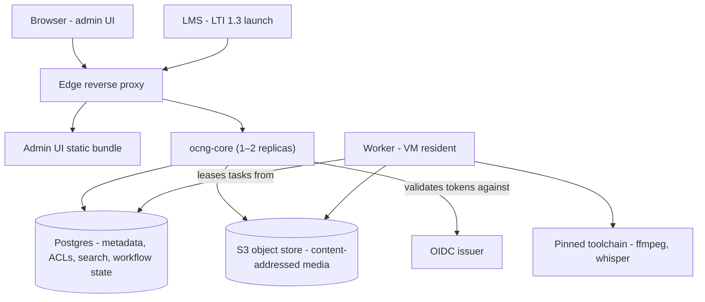

# gophercast

gophercast (also referred to as `ocng` within this project) is a proof-of-concept
reimplementation of the Opencast video platform core as a small cloud-native system:
one core binary, one worker binary, Postgres, and any S3-compatible object store.
It serves the existing Opencast admin UI and speaks enough of the existing API
surface to run real archives migrated from an existing installation.

**Status: proof of concept — not for production.**

✅ **What it can do today:**
- end to end: migrate one organisation's archive
- ingest
- process media through its workflow engine
- five operations are implemented — inspect, encode, speech-to-text, snapshot, publish
- search
- serve media with enforced ACLs
- manage events and series through the Opencast admin UI
- Identity is OIDC plus LTI 1.3.

🚧 **What it cannot do yet:**
- the video editor
- Studio
- scheduling and capture-agent support
- a bundled player
- the other ~93 workflow operations
- full external-API parity
- running workers on Kubernetes
- sharing workers across instances
- reclaiming storage space (the collector is built but disabled pending a safety proof).

## Architecture

An edge reverse proxy fronts one or two core replicas and serves the
admin UI bundle. The core owns one Postgres database — workflow state,
search, ACLs, and metadata all live there; there is no separate search
cluster — and one S3-compatible object store holding media as
content-addressed, immutable objects. Workers lease tasks from the
database (a single-winner transition, so running extra workers is safe)
and process media with a pinned toolchain of ffmpeg and whisper. Identity
is OIDC bearer tokens, validated against one configured issuer, plus
LTI 1.3 launches from registered platforms.



The diagram shows what runs today. Not drawn because not built: the
Kubernetes Job worker path (the adapter is deferred) and the shared
cross-instance worker pool (designed) — both are covered, with their
maturity, under "What is different" below. The storage collector is built but disabled
and sits outside the running data path.

**Tech stack:**
- Go (single static binaries for core, worker, and the migration tool)
- Postgres (no other databases supported right now)
- any S3-compatible object store
- a reverse proxy (Caddy in the sample stack, and the edge routes are deliberately expressible as Kubernetes Ingress rules)
- On VMs: rootless podman with systemd quadlet units; docker compose is compatible by construction but unexercised
- Kubernetes itself is designed for but its worker adapter is deferred
- What an operator does not run: an OSGi runtime, a separate search service, or a message broker.

## Deploy

The evaluation stack is a single compose file: edge proxy, admin UI, two
core replicas, one worker, Postgres, MinIO, and a dev Keycloak. Proven on
rootless podman with SELinux enforcing; docker compose is compatible by
construction but unexercised.

```bash
cd deploy
# one-time: stage the admin UI bundle (a build artifact of the Opencast
# admin UI — not tracked in this repo; build or obtain it, then copy)
mkdir -p admin-ui-bundle && cp -r /path/to/opencast/modules/admin/build/. admin-ui-bundle/
mkdir -p data/postgres data/minio

podman compose -f compose.yaml up -d --build
```

Open http://localhost:8800/. Details, the full configuration reference,
and the pilot-gate table (settings you must not enable yet, and why) are
in [deploy/README.md](deploy/README.md) and
[deploy/CONFIG.md](deploy/CONFIG.md). For VM deployments without compose,
systemd quadlet units are in [deploy/quadlet/](deploy/quadlet/).

## Tests

This repository ships the pure-logic unit tests: `go test ./internal/...`
runs green on a fresh checkout with no database, no object store, and no
environment configuration. The integration/e2e suite (real Postgres, real
S3 backend, assembled-stack scenarios) is not included in this repository.

One operational note on schema migrations: the migration ledger records
each applied step's byte-hash and refuses a step whose SQL no longer
matches — applied history is immutable, changes ship as new steps. A
consequence: running two *different builds* of ocng against ONE shared
database can trip this check even when both builds are individually
correct, because the same step id may carry different bytes. Use a fresh
database per build (the dev compose stack does); never point two divergent
checkouts at the same schema.

## Migrate from an existing Opencast

Migration reads your source through its authoritative representations
only — the snapshot column, the security attachments, the series and
search ACL columns — and writes the gophercast target additively. It holds no
credential that can write the source.

The supported input today is an export: copy your archive data into the
fixture-export layout (CSV column exports plus archive files); a
direct-connection read-only source backend is future work. This means a
copy of your archive is the only supported input — which is also the
responsible posture for a proof of concept. Do not point tooling at your
only copy of anything.

```bash
ocng-migrate -source /path/to/export -org <your-org-id>
```

One run migrates one organisation into one gophercast instance, as a one-shot
container against the same database and bucket the core serves. Exit
codes: `0` complete; `3` complete with HOLDs — records where the tool
found something a human must decide; each has a line in the
`migration_report` table naming what and why; `1` failed. The tool never
works around an ambiguous record.

## What is different, and how far each piece has got

Each item carries its honest maturity: **built and proven** (running and
tested today), **demonstrated on one case** (real, with the specific
bound stated), or **designed** (the goal is real; the code is not there
yet).

**📦 Simplified stack — built and proven.** The running system is one core
binary (1–2 replicas), one worker, Postgres, and an S3 store, behind an
ordinary reverse proxy. There is no OSGi runtime, no search cluster, and
no message broker to operate.

**🔍 Search runs in Postgres — built and proven.** Full-text search and
ACL-filtered queries run in the same database that holds the data,
maintained in the writer's transaction — one fewer stateful service to
operate, and no window in which authorization and its index disagree.
Measured to about 100k events and 1000 roles; larger scale is untested.

**🗃️ Content-addressed storage — built and proven.** Every media element is
stored by content hash in an S3 bucket. Identical bytes are stored once;
objects are immutable, so replication and backup are straightforward.
Space reclamation (garbage collection) is built but ships disabled until
a remaining safety proof exists — the config reference marks it must-not-set.

**🖥️ Runs complete on a single small host — demonstrated on one case.** The
entire stack, including the dev identity provider, runs on one
workstation under rootless podman with SELinux enforcing. No comparative
resource measurement against other setups has been taken; judge the
footprint from the component list.

**☸️ Kubernetes and VMs both in mind — VM built, K8s designed.** The VM path
(compose and systemd quadlet units) is built and proven. The edge routes
are deliberately expressible as Ingress rules, and the Kubernetes Job
adapter for workers is shaped in code — but it is deliberately unbuilt
until a real cluster can validate it, and returns an explicit "deferred"
error today.

**⚙️ Task-scoped worker execution, matched to the environment — built and
proven on VMs.** Every unit of media work is one leased task with a
single winner: redundant workers claim safely and exit cleanly, so
over-provisioning is safe by construction. On VMs a resident worker runs
tasks as admitted subprocess slots against declared CPU/memory/GPU
capacity; on Kubernetes the designed shape is one ephemeral Job per task
(the adapter is deferred, above).

**🔒 Tenant isolation by instance — the isolation is built; the shared pool
is designed.** Each tenant runs its own gophercast instance with its own
database. Isolation is structural, not software-enforced: tenant data
cannot cross because there is no other tenant in the system to cross
into, which dissolves whole classes of cross-tenant bug outright. The
designed efficiency is that stateless workers pool across instances, so
idle per-tenant worker capacity is not paid for. Today the per-instance
model is built and is how migration works (one organisation per
instance); the shared cross-instance worker pool is the next piece —
a worker currently binds to one instance's database.

**🔄 Schema changes without read downtime — demonstrated on one case.** The
mechanisms are built: applied migrations are ledger-skipped, indexes
build concurrently, and DDL that must lock a serving table runs under a
lock timeout with bounded retry. Two core replicas may boot and migrate
concurrently; an advisory lock picks one winner. This was proven on one
live schema migration under serving load with zero failed reads. A full
cross-version upgrade playbook does not exist yet.

## Why it is built this way

- **Content addressing** makes storage state trivial to reason about:
  objects are immutable and named by their bytes, so "is this the right
  file" and "do these two events share this file" are hash comparisons,
  and rollback of a migration is repointing references, not restoring
  data. See `internal/cas`.
- **Environment-matched execution** keeps one task lifecycle (lease,
  renew, single winner) and varies only who runs the process — a
  subprocess slot on a VM, a Job on Kubernetes. The engine's invariants
  are documented in `internal/engine/INVARIANTS.md`.
- **Search in Postgres** was a measured choice: denormalised role arrays
  under GIN indexes met the latency targets at the scale tested, and
  projection-in-the-writer's-transaction removes an entire
  consistency-lag class. The reasoning and numbers are in
  `internal/search/schema.sql` and `internal/search/query.go`.
- **One instance per tenant** is a superset of multi-tenant serving — you
  can always run more instances — and it removes cross-tenant
  correctness obligations from every line of code instead of enforcing
  them in some of it.

Package comments cite architecture decision records (ADR-002, 008, 009,
010, 011, 012) where a decision binds the code. The ADR documents
themselves are not published in this repository yet; the package comments
carry the substance of each decision at its point of use.
